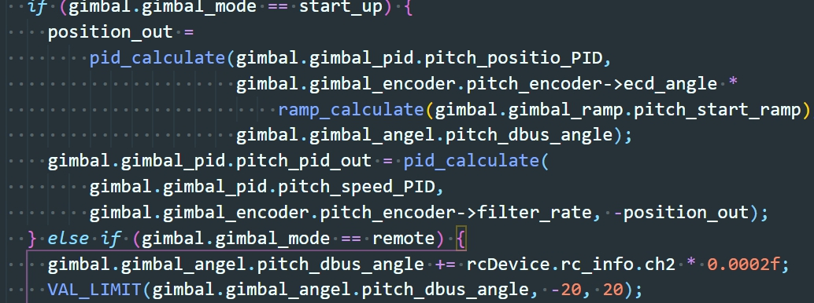
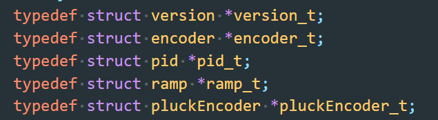

<!--
 * @Description: readme
 * @Version: new
 * @Autor: maxin
 * @Date: 2020-02-05 12:48:52
 * @LastEditors: maxin
 * @LastEditTime: 2020-08-01 10:40:31
 -->
# 英雄_船新版本
#### 介绍
同统一代码结构的全新版本英雄机器人代码
MDK 版本：5.31.0.0  
HAL库版本：V1.25.0 
FreeRTOS版本：V10.2.1  
CubeMX版本：V6.0.0  

#### 代码规范说明
1. 代码风格为 Google 风格，展示效果如下：

2. 所有结构体指针均重命名，格式为 结构体名_t，展示效果如下：

#### 代码架构说明
1. 本程序共有4个任务，其中，云台、底盘、射击任务为实时任务，优先级最高，严格控制执行周期。呼吸灯任务优先级最低，裁判系统解算任务优先级中等。
2. 串口1接收遥控数据，串口3接收裁判系统数据，串口4接收视觉数据。
3. 呼吸灯不同颜色代表程序运行的不同状态。
4. 遥控S1下拨为软件重启，可以一键重启整个代码
## 参考资料汇总
1. [FreeRTOS钩子函数详解](http://www.360doc.com/content/18/0418/13/3205689_746629252.shtml)  
2. [FreeRTOS系统延时分析](https://blog.csdn.net/zhzht19861011/article/details/51705148)  
3. [FreeRTOS任务介绍](https://blog.csdn.net/tichimi3375/article/details/80669839)  
4. [FreeRTOS软定时器介绍](https://blog.csdn.net/qq_18150497/article/details/52874310)  
5. [滤波算法大全](https://blog.csdn.net/daidi1989/article/details/96480202#)  
6. [FreeRTOS任务调度](https://blog.csdn.net/pfysw/article/details/80964603)  
7. [PID 控制参数如何设定调节](https://blog.csdn.net/qq_38639612/article/details/90646976)  
8. [C语言共用体](http://c.biancheng.net/view/2035.html)  

